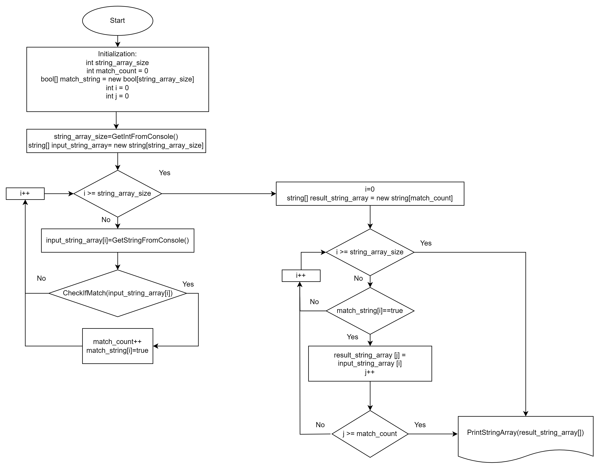

# Описание контрольной работы

Данный код позволяет находить строки данных, длина которых меньше или равна указанному в коде значения из массива строк введенных через консоль/ терминал. 

**Полужирный текст**

*Курсив текст*

## Блок схема данного алгоритма

На данной блок схеме можно увидеть, что программа после получения массива данных через консоль, проверяет элементы массива, т.е. строки на соответствие требованиям контрольного задания и запоминает адресс соответствующих элементов массива на другом булевом массиве. 
После запоминания адрессов соответствующих элементов, программа выводит элементы с соответствующими параметрами на консоль.


## Функции
### ReadIntFromConsole()
```
int ReadIntFromConsole() 
{
    int target_data;
data_input:
    Console.WriteLine("Input string array length:");
    target_data = Convert.ToInt32(Console.ReadLine());
    if (target_data == 0)
    {
        Console.WriteLine("Length of input string must differ from 0");
        goto data_input;
    }
    return target_data;
}
```
Данная функция исользуется для считывания количества элементов массива среди которых потребуется поиск соответствующих требованиям задания строки.
Так же данная функция выводит текст ошибки если пользователь ввел цифру "0" и просит ввести значение 
### ReadStringFromConsole()
```
string ReadStringFromConsole()
{
    string input_string = "0";
data_input:
    Console.WriteLine("Input some characters:");
    input_string = Console.ReadLine();
    if (input_string.Length == 0)
    {
        Console.WriteLine("Length of input string must differ from 0");
        goto data_input;
    }
    else
    {
        return input_string;
    }
}
```
Данная функция применяется для присваивания элементам массива значений из консоли. Функция так же имеет проверку длины строки. 
### CheckIfMatch()
```
bool CheckIfMatch(string input_string, int comp_value)
{
    if (input_string.Length == comp_value)
    {
        return true;
    }
    return false;
}
```
Данная функция применяется для определения соответсвия элемента массива к требованиям задания. 

Использования функции для данной задачи является удобным, т.к. при изменении условий задачи или при ошибке редактирования логики определения соответствия, редактировать и исправлять весь код программы не требуется, достаточно поменять логику обработки только данной функции.

## Основной код
### Инициализация и заполнения значений массива
```
int input_data_size = 0;
int match_count = 0;
int required_string_length = 3;
input_data_size = ReadIntFromConsole();
Console.WriteLine(input_data_size);
bool[] match_string_adress = new bool[input_data_size];
string[] input_data = new string[input_data_size];
for (int i = 0; i < input_data_size; i++)
{
    input_data[i] = ReadStringFromConsole();
    if (CheckIfMatch(input_data[i], required_string_length))
    {
        match_string_adress[i] = true;
        match_count++;
    }
    else
    {
        match_string_adress[i] = false;
    }
}
```
Данная часть кода инициализирует нужные для программы переменные, запрашивает данные длины массива и элементов массива и присваивает к определенным переменным программы. Так же при вводе значений элементов массива, сразу же проверяет соответсвие данного элемента массива требованиям задания посредством функции CheckIfMatch() и сохраняет адреса соответствующих элементов на массиве match_string_adress[]. 
### Вывод результатов
```
if (match_count > 0)
{
    Console.WriteLine("");
    if (match_count == 1)
    {
        Console.WriteLine("String that matches the required string length is:");
    }
    else
    {
        Console.WriteLine("Strings that match the required string length are:");
    }
    for (int i = 0; i < input_data_size; i++)
    {
        if (match_string_adress[i])
        {
            Console.WriteLine(input_data[i]);
        }
    }
}
```
Данный код применяется для вывода результатов программы после ввода необходимых данных. Данная часть кода проверяет наличие соответствующих требованиям элементов из списка введенных данных, при отсутствии которых завершает работу программного кода.
Так же, проверяется равенство количества соответствующих элементов к одному, что необходимо для правильного вывода сообщения без грамматических ошибок.

## П.С.
При изменении значения переменной required_string_length можно изменить условие сортировки элементов.
